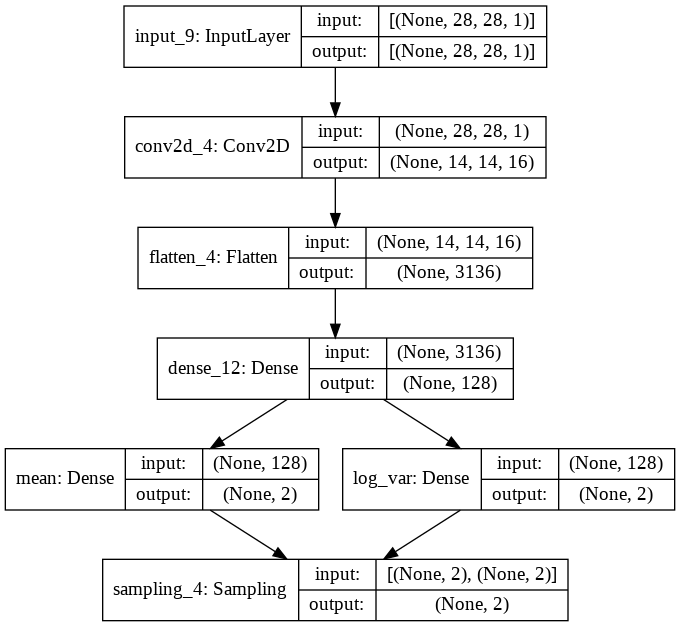
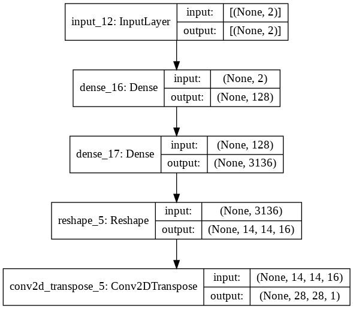
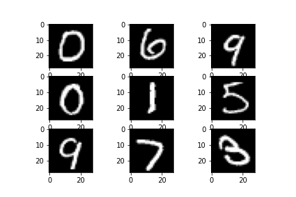
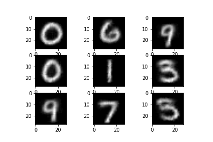

# Variational-Autoencoders (VAEs)

## Model Visualization
### Encoder 
<p align = "center">
    
</p>

### Decoder
<p align = "center">
    
</p>

## Dataset and Training
### Dataset
*MNIST Dataset* is used for training the model.  
### Training the model
1) Optimizer - Adam
2) 3 types of loss trackers
    1) Reconstruction Loss
    2) KL divergence Loss
    3) Total Loss
3) Epochs for training - 30
4) Latent Dimension Size - 2
5) Callbacks used - Early Stopping, Reduce LR 
6) Model Weights saved to ```model_weights.h5``` after training.

For retraining, load the previous weights to the model and train your new model on top of the previous one.


## Visualizing the Outputs
Run the ```main.py``` file to visualize the following:
1) Latent Space Representations of the Dataset as encoded by the Encoder network.
<p align = "center">
</p>
2) Reconstructed Images of the images present in the test set. 
<p align= "center">
 <br>
<text><b>Real Images</b></text>
</p>
<p align= "center">
<br>
<text><b>Reconstructed Images</b></text>
</p>

3) Newly generated images formed by sampling random noise from the latent space and feeding it to the Decoder network.
<p align ="center">
<br>
<text><b>Generated Images</b></text>
</p>


## References

1) [An awesome article giving a basic intuition of mathematics behind VAEs.](https://towardsdatascience.com/understanding-variational-autoencoders-vaes-f70510919f73)

2) [Keras code reference for writing the loss functions.](https://keras.io/examples/generative/vae/)

3) [A lecture giving a deep understanding of probability behind VAE.](https://www.youtube.com/watch?v=uaaqyVS9-rM)

4) [Paper on VAEs](https://arxiv.org/pdf/1312.6114.pdf)
